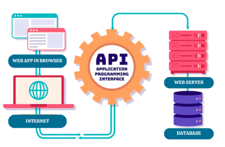

# BE - Database - Day 8
## Recap
- Environment variables
  - Set environment variable
  - Load environment variable

## Agenda
- MongoDB
  - What is database?
  - Concept: NoSQL
  - Setup a local mongodb server
- Basic queries

## Database basics
### What is a database?
- A database is a place to store data.
- A database is a structured collection of data 
- It organizes data so it can be easily _accessed_, _managed_, and _updated_.

 

### _Technically you can just use text files for data storage_
  - But actually Disk I/O is waaaaaaay too slow of that
  - And databases have many specialized features

### _Databases are a vast topic_
  - Many engineers specialize in specifically database administration
  - We will cover the basic concepts

### _There are MANY different kinds of databases_
  - **SQL databases** 
      - Extremely common
      - Based on the SQL language
      - Very structured data
  - **NoSQL databases**
      - Basically, any database that is not SQL
      - A document database stores data in documents.
      - Many, many, different kinds
          - Some are based on documents, like an array of objects
          - Some are based on key-value pairs, like one object

  

## MongoDB
- MongoDB is a NoSQL database based on documents
    - You store data organized as collections documents
    - A document collection might be for example
        - Products
        - Users
        - Comments
        - Posts

- Using MongoDB is very much like just working with JavaScript
    - **Conceptually** Collection of documents <-> Array of Objects

- Let's install MongoDB server locally
    - [Installation process](https://www.mongodb.com/docs/manual/tutorial/install-mongodb-on-ubuntu)

### The MongoDB shell
- `mongosh` is the MongoDB shell. 
- It allows you to interact with your MongoDB server. 
- You can run commands to manage and query your data.

### Basic Commands
- `use MyShop`
    - In one database server, you can have _many databases_
    - Usually one database serves one application
    - MyShop for your e-commerce website

- Normally you would have _multiple users_ for the database server
    - You would also log in using a specific **username** and **password**
    - Our local server doesn't have a need for that
    - For production you NEED very high security

- Here `products` is a **collection**
    - We inserted some **documents** into the collection
    - You can run basic JavaScript operations

- Technical note: the _documents are not actually JSON_
    - They are _BSON_
    - A format based on JSON made specifically for MongoDB
    - Different data types than with JSON
    - What data types did we have for JSON
        - string
        - number
        - object
        - array
        - boolean
        - null
    - For BSON [Here](https://www.mongodb.com/basics/bson#bson-specifications-and-bson-types)

- Each document automatically got an `_id` property
    - This thing is an ObjectID
    - Practically always you will want an unique identifier for every document
    - _Properties_ are often called **fields**

- There are two mains ways of doing IDs
    - Automatically incremented number
        - `{ id: 1 }`
        - `{ id: 2 }`
        - `{ id: 3 }`

    - Completely randomized strings
        - `{ id: "62255c53-3984-4c55-8a80-5ab2be6b176c" }`
        - `{ id: "053693df-9112-4305-84f2-0ad8f367acb8" }`
        - `{ id: "59b7b4d9-3737-4c69-b2f3-dcba35790f43" }`

### IDs by doing incremented integers

- Pros:
    - Easy to type
    - Easy for people to remember
    - Short: `http://example.org/users/42`

- Cons
    - Merging two collections both with overlapping IDs is very difficult
    - Moving data between collections can cause ID conflicts

### IDs by doing randomized strings

- Pros:
    - Using UUIDs, you will _never_ run into an ID conflict
        - Universally Unique IDs

- Cons
    - Difficult to type or remember
    - `http://example.org/users/053693df-9112-4305-84f2-0ad8f367acb8`

- Often these are combined with something like a username for URLs
    - With `{ username: "nili", id: "053693df-9112-4305-84f2-0ad8f367acb8" }`
        - BEFORE `http://example.org/users/053693df-9112-4305-84f2-0ad8f367acb8`
        - AFTER `http://example.org/users/nili`

### Object IDs

- The ObjectIDs MongoDB are more like incremental than completely random
    - But they have an aspect of randomness

> The 12-byte ObjectId consists of:
> - A 4-byte timestamp, representing the ObjectId's creation time
> - A 5-byte random value generated per process, unique to machine and process
> - A 3-byte incrementing counter, initialized to a random value

## Wrap-up

- Databases store information in an organized way
- SQL and NoSQL databases
- NoSQL: Document based, key-value based, etc.
- MongoDB is a document based NoSQL database
- MongoDB terms: `collection`, `document`, `field`
- MongoDB stores data in JSON-like BSON
- `mongosh` is kind of like the Node REPL or the terminal for MongoDB
- ObjectIDs are partly incremental

## Exercises
- [11_be-database-mongosh](https://classroom.github.com/a/jdQEkw5v)

