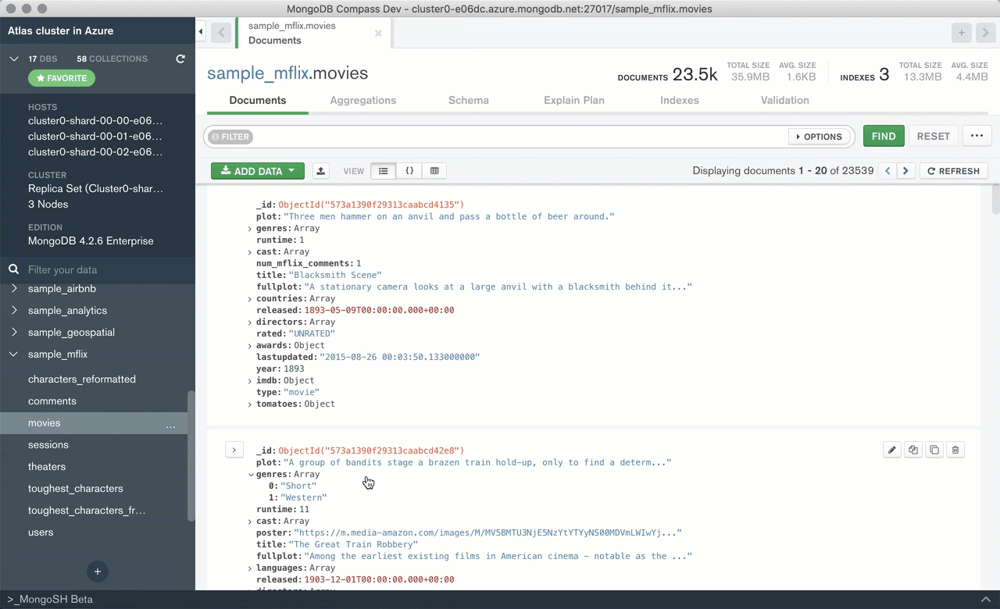
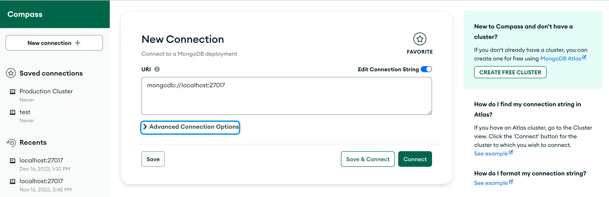

# BE - Database - MongoDB on Cloud

## Recap

## Agenda

## MongoDB On the Cloud
### 1. Review: Connecting with Compass to Localhost
- **What is Compass?**
  - Compass is a graphical user interface (GUI) for MongoDB.
  - It allows users to visualize, manipulate, and query their MongoDB data.
  

- **Connecting to Localhost:**
  - Open Compass on your computer.
  - In the "New Connection" window, enter `mongodb://localhost:27017` as the connection string.
  - Click "Connect" to establish a connection to your local MongoDB server.
  - Once connected, you can explore databases, collections, and documents stored locally.
  

### 2. MongoDB Atlas Account
- **What is MongoDB Atlas?**
  - MongoDB Atlas is a fully-managed cloud database service for MongoDB.
  - It provides automated backups, scaling, and maintenance.
- **Creating an Atlas Account:**
  - Visit the MongoDB Atlas website and sign up for an account.
  - Follow the prompts to create a new project.
  - Choose a cloud provider (AWS, Azure, Google Cloud) and a region for your database cluster.
  - Create a new cluster by selecting the desired configuration (e.g., number of nodes, instance size).

### 3. Connecting with Compass to MongoDB Atlas
- **Getting the Connection String:**
  - In your MongoDB Atlas dashboard, go to the "Clusters" tab.
  - Click on the "Connect" button for your cluster.
  - Select "Connect with MongoDB Compass" and copy the provided connection string.
- **Connecting to Atlas:**
  - Open Compass on your computer.
  - Paste the connection string into the "New Connection" window.
  - Replace `<username>` and `<password>` with your Atlas database user credentials.
  - Click "Connect" to establish a connection to your MongoDB Atlas cluster.
  - You can now manage your cloud-based MongoDB databases and collections through Compass.

### 4. Testing Basic Operations
- **Creating a Database:**
  - In Compass, click on the "Create Database" button.
  - Enter a name for your new database and a name for the initial collection.
  - Click "Create Database" to save it.
- **Inserting Documents:**
  - Navigate to your collection and click on "Insert Document."
  - Add data to your document using the JSON editor.
  - Click "Insert" to save the document.
- **Querying Data:**
  - Use the "Filter" field to run queries on your collection.
  - For example, to find documents with a specific field value, enter `{ "field_name": "value" }` and press "Find."
- **Updating Documents:**
  - Select a document you want to update.
  - Click "Edit" and modify the fields as needed.
  - Click "Update" to save the changes.
- **Deleting Documents:**
  - Select a document you want to delete.
  - Click on the trash icon to remove it from the collection.
  - Confirm the deletion when prompted.

## Exericses
- [13_be-database-compass-crud](https://classroom.github.com/a/fu27-6_I)

