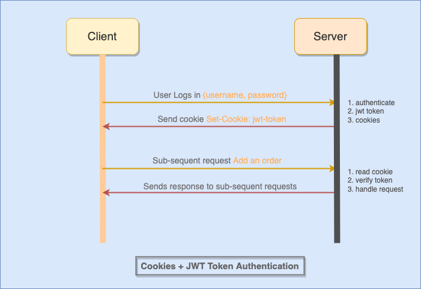

## Authorization

### User Roles and Permissions
Role-based access control (RBAC) is a widely used approach to controlling access to resources in applications. It involves assigning roles to users and determining what actions earch role is allowed to perform.

### Implement Middleware
- Once you have defined your roles, you can implement middleware to check if `the user has the required role to access a particular resource`.

- This middleware can be added to the `route handlers for protected routes`. 

- The middleware can check the user's role agains the required role for the resource and either `grant or deny access`.

    ```js
    export const restrictTo = (...roles) => {
        return (req, res, next) => {
            //check if allowed roles includes role of my user
            if (!roles.includes(req.jwt.userrole)) {
                throw createError(403,"You do not have permission to perform this action!");
            }

            next();
        };
    };
    ```


### Apply Middleware to Routes
After defining the middleware, you can apply it to the routes that required role-based access control. For example, to protect the `POST /products` route for admin users, you can apply `restrictTo()` middleware like this:

```js
router.route('/products')
    .post(protect(), restrictTo('admin'), addNewProduct);
```

In this example the middleware `restrictTo()` is applied on the route and ensuring that only users with `admin` role can access this resource.
<!-- 
 -->


# Cookies 

## State and the server - Stateless HTTP
In a stateless HTTP protocol, `the server does not store any information about previous requests made by the client`. This means that every time the client sends a request, the server treats it as a new request and sends a response accordingly. 

This can create problems when developing web applications that require state to be maintained between requests.

## Cookies
One way to maintain state between requests is through the use of cookies. 
- `Cookies are small text files that are stored on the client's computer and can be accessed by the server`. 

- Cookies are `sent along with every request` made to the server, allowing the server to read and write data from and to the cookie.

### Using cookies to save state across requests
Cookies can be used to save state across requests. For example, a `user's login credentials` can be stored in a cookie, `allowing the user to remain logged in between requests`.



### Setting cookies
Cookies can be set in the server response using the `res.cookie()` method. This method takes three parameters: 
- The name of the cookie
- The value of the cookie.
- The options parameter

```javascript
res.cookie('username', 
           'john.doe', 
           {httpOnly: true, expires: Date.now() + 3_600_000 * 24 });
```

### Using cookieParser to read cookies: req.cookies
To read cookies sent from the client, the `cookie-parser` middleware can be used. This middleware `parses the Cookie header sent by the client and populates the req.cookies object` with the parsed cookies.

```javascript
//in server.js file
import cookieParser from 'cookie-parser';
app.use(cookieParser());
```


```javascript
//How to read cookies from sub-sequent requests?
app.get('/', (req, res) => {
  
  const username = req.cookies.username;
  res.send(`Welcome back, ${username}!`);

});
```


### Cookie pitfalls: memory limit, security vulnerabilities
While cookies are a useful tool for maintaining state, there are some potential issues to keep in mind. One issue is the memory limit of cookies. Each cookie can store only a limited amount of data, typically around `4KB`. 

Another issue is that cookies can be vulnerable to security attacks, such as cross-site scripting (XSS) and cross-site request forgery (CSRF). `Care should be taken to ensure that cookies are used securely to avoid such vulnerabilities`. 

