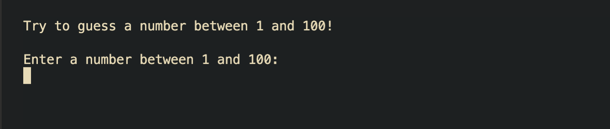
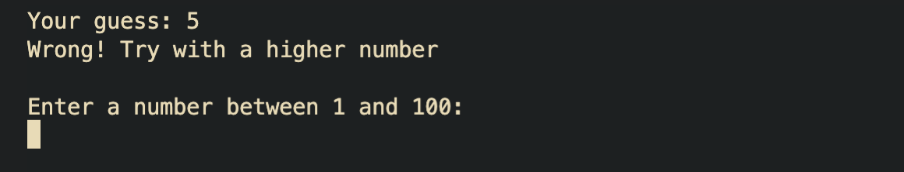
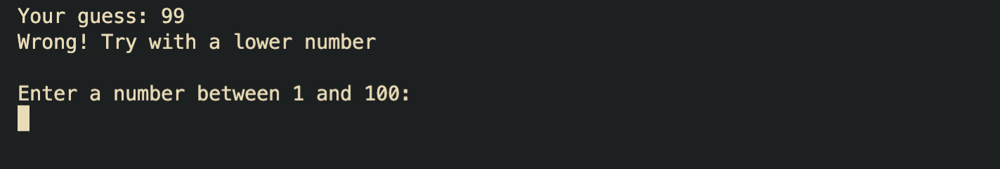

# Guess the number

Create a program that challenges the player to guess a number between 1 and 100.

## Instructions

- The program generates a new random number every time it runs and prompts the player to guess it
- if the player guesses the number, the program prints a congratulation message and stops the execution
- if the guess is wrong, the program tells the player if the guess is higher or smaller than the random number and asks the player to keep trying

## Commands to use

- `console.clear()`: deletes everything present in the console
- `readline.question()`: using the `readline-sync` package, it lets you get and save an input from the console
- `console.log()`: as always, use it to output any kind of message to the console

## Bonus

Add a feature to limit the number of available guesses and print them on the screen

## Screenshots

### Start

### Wrong guess

### Win

