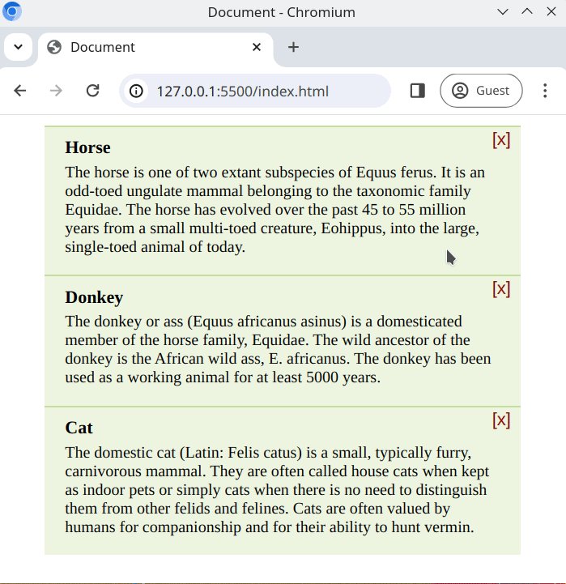

# Click to remove

We can enhance the experience of the UI by monitoring click events and by modifying the DOM dynamically. Let's try to apply that here!

## Task

The prepared webpage contains a list of cards. The top right corner of each card has a close button "[X]". When this button is clicked, the corresponding card should be removed from the DOM.

- The [HTML](./index.html) and [CSS](./style.css) have already been prepared for you
- You can use VS Code live server to view the interface

## Requirements

- Write your solution in [script.js](./script.js)
- Do not edit the **HTML** or **CSS**
- On the `click` event, the parent `div` should be removed from the DOM
- You should only register **one** event listener for the click event
- Use event delegation

## Expected Result

