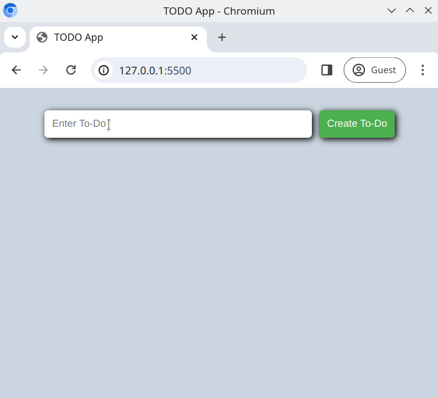

# ToDo List

Building a "todo" list app is something _all_ developers have done when learning to code. Now is your turn!

## Task

The todo application is a simple list with an editor. A user can add and remove items from the list.

Writing your solution in [index.html](./index.html), [js/main.js](./js/main.js) and [css/style.css](/css/style.css), create a functioning todo application.

## Requirements

- There should be an `<input />` field for the user to add a todo entry
- There should be a `<button>` which will add the todo entry to the list
- When a user has added a todo to the list, the todo entry should be displayed on the page
- Each todo entry should have the UI elements;
  - a **delete** `<button>`, which removes the todo item from the list

## Expected Result

## Bonus Task

Add a **done** `<button>` (it could have an icon of a checkmark) for each todo entry, which will toggle a strikethrough effect on the todo item text.
