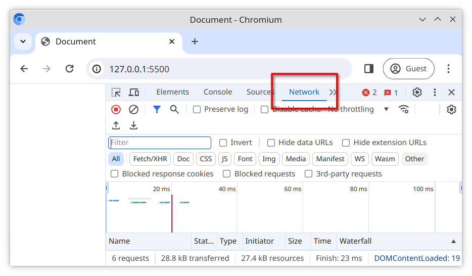
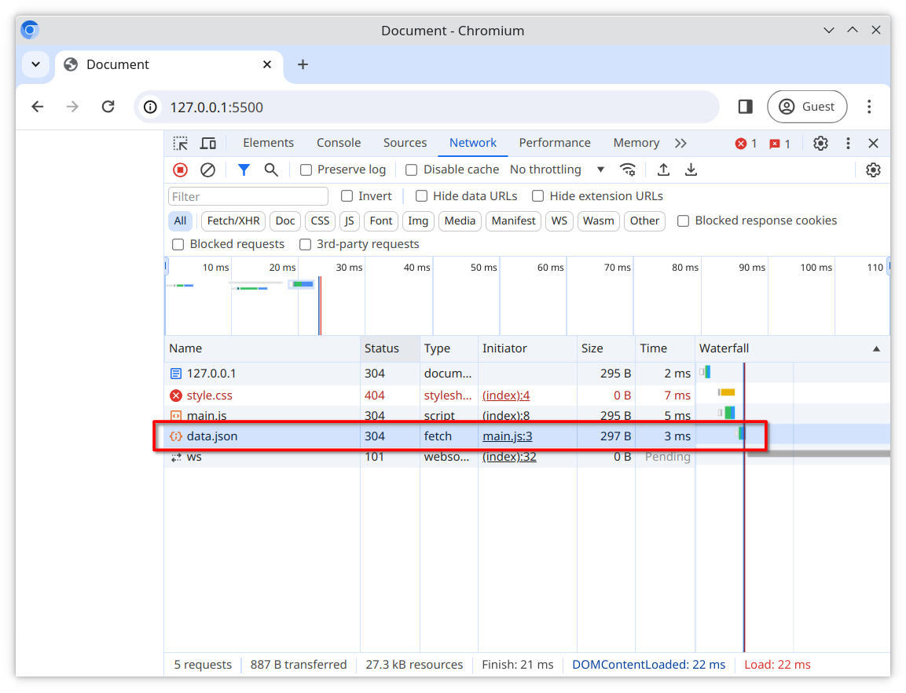
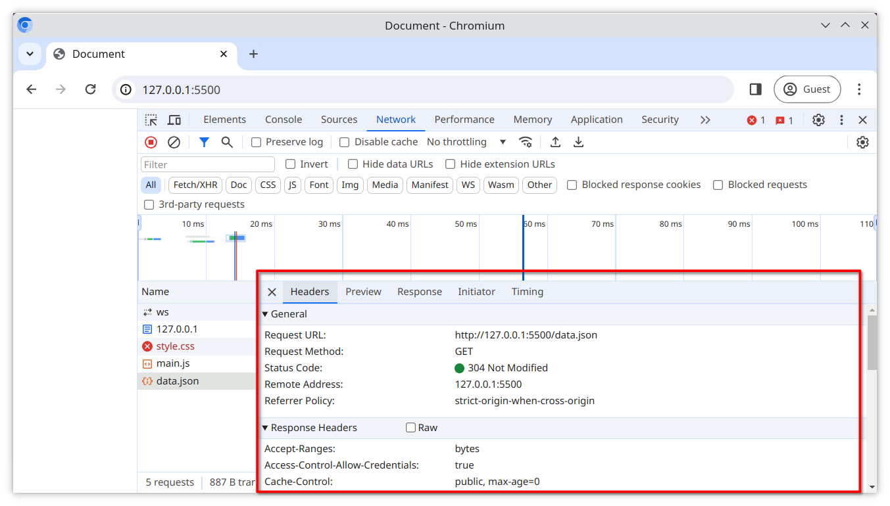

# JavaScript with Promises

Promises are objects that represent the eventual outcome of an asynchronous operation. We can use them to handle non-blocking behaviour.

## Tasks

### Task 1

Write the following code in order from first to last;

1. Use `console.log()` to print the text "Before"
2. Use `fetch` to load the local file [data.json](./data.json) into your application
3. Use `console.log()` to print the text "After"

### Task 2 - Creating and using Promises

1. Attach a `then()` method to your `fetch` statement
2. Inside the `then()` method, write a `console.log()` statement to print the text "File downloaded".
3. Run your code in the browser using VS Live Server
4. View the **console** in the browser developer tools

> The order of your `console.log()` statements might surprise you!

### Task 3 - Inspecting requests

1. Open the **Network** tab

2. Select the file `data.json` from the request list (you may have to reload the page to see it)

3. An additional submenu will appear, where you can view additional details about the request

### Task 4

By inspecting the additional details about the request, answer the following question:

- How long did the browser take to load the file [data.json](./data.json)?
