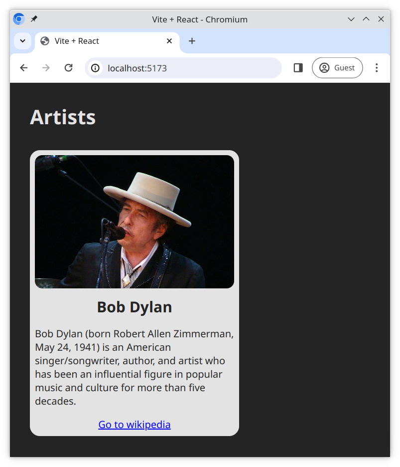

# Data binding a simple object to JSX

With this exercise, we will simulate a common use case - rendering a layout in React JSX populated with data from a JavaScript object.

## Tasks

Complete the tasks below to build the card layout.

The [CSS](./src/index.css) has already been prepared for you. You do not need to edit this file.

### Task 1

Copy the following HTML template into [/src/App.jsx](./src/App.jsx)

```html
<div class="card">
  
  <div class="card-body">
    <h5 class="card-title">Card title</h5>
    <p class="card-text">
      Some quick example text to build on the card title and make up the bulk of
      the cards content.
    </p>
    <a href="#" class="card-button">Go somewhere</a>
  </div>
</div>
```

### Task 2

React uses the `className` attribute instead of `class` for specifying CSS classes on elements.

- In the HTML template you used, rename the HTML attrbute `class` to `className`

### Task 3

The `data` object in the [/src/App.jsx](./src/App.jsx) file contains some basic information which we can render, such as `image`, `cardTitle`, etc.

- Populate the layout with information from the `data` object. For example the text in the card title will come from the `data` property `cardTitle`.

## Expected result


