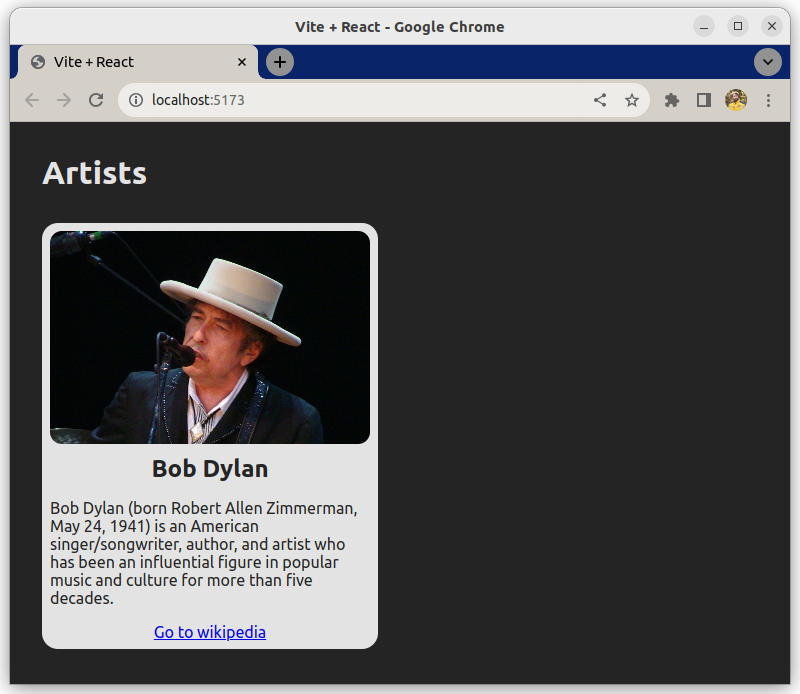

# Ein Layout erstellen

Diese Übung handelt davon, ein Layout mit JSX basierend auf einem Objekt zu erstellen, das Daten enthält.

## Anforderungen

Du hast ein `data` Objekt, das Informationen über Bob Dylan enthält (Bild, Titel, usw).

```js
const data = {
  image: "https://upload.wikimedia.org/wikipedia/commons/thumb/0/02/Bob_Dylan_-_Azkena_Rock_Festival_2010_2.jpg/800px-Bob_Dylan_-_Azkena_Rock_Festival_2010_2.jpg",
  cardTitle: "Bob Dylan",
  cardDescription: "Bob Dylan (geboren als Robert Allen Zimmerman, 24. Mai 1941) ist ein amerikanischer Singer/Songwriter, Autor und Künstler, der über fünf Jahrzehnte hinweg eine einflussreiche Figur in der Popmusik und Kultur war.",
  button: {
    url: "https://en.wikipedia.org/wiki/Bob_Dylan",
    label: "Gehe zu Wikipedia"
  }
}
```

Verwende die Informationen in `data`, um eine Karte zu rendern. Zum Beispiel wird der Text im Karten-Titel von `data.cardTitle` kommen.

Das CSS für die Karte ist bereits enthalten und hier ist eine HTML-Vorlage für die Karte:

```html
<div class="card">
  
  <div class="card-body">
    <h5 class="card-title">Card title</h5>
    <p class="card-text">Some quick example text to build on the card title and make up the bulk of the cards content.</p>
    <a href="#" class="card-button">Go somewhere</a>
  </div>
</div>
```

## Beispiel


