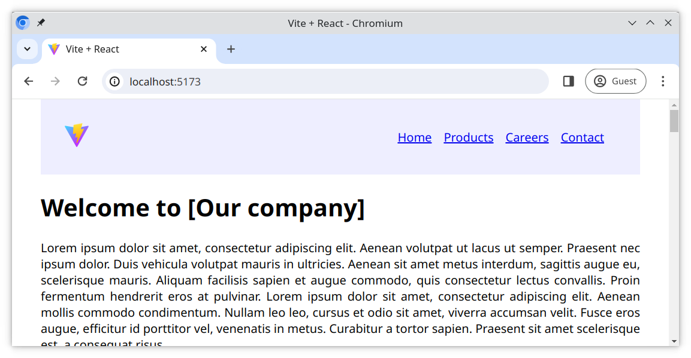

# Building a layout from components

More complex sites will break down their design into multiple, functional parts we call components. Try this approach here with this exercise.

## Tasks

Follow the tasks to create a website layout using components. Some of the code already exists, some of it you will have to code yourself.

### Example

### Task 1

- Change the page title to "Welcome to Our Company"
- Within the `<main>` element in [src/App.jsx](./src/App.jsx), add a link that takes the user to the top of the page

### Task 2

We want to include a `<footer>` on our website;

- Import the `Footer` component from [/src/components/Footer.jsx](./src/components/Footer.jsx) into [src/App.jsx](./src/App.jsx)
- Place the `Footer` component after the closing tag for the `<main>` element

### Task 3

We will create a separate component for the `<header>` element;

1. Create a file `Header.jsx` in the [src/components](./src/components/) folder
2. In the new `Header.jsx` file, create an empty component called `Header`
3. Move the `<header>` element from the [src/App.jsx](./src/App.jsx) file into this new component
4. Move the file [src/Header.css](./src/Header.css) into the [src/components](./src/components/) folder
5. Import and **use** the new `Header` component in [src/App.jsx](./src/App.jsx)

> 🐷 Make sure your imports and exports are working correctly!

> 🐏 Moving the header might also mean updating the imports or paths for any related assets such as images!

### Task 4

We will create a separate component for the `<main>` element;

1. Create a file `Main.jsx` in the [src/components](./src/components/) folder
2. In the new `Main.jsx` file, create an empty component called `Main`
3. Move the `<main>` element from the [src/App.jsx](./src/App.jsx) file into this new component
4. Import and **use** the new `Main` component in [src/App.jsx](./src/App.jsx)

> 🐥 Make sure your imports and exports are working correctly!

> 🤖 Do not move the file [data.js](./src/data.js)
