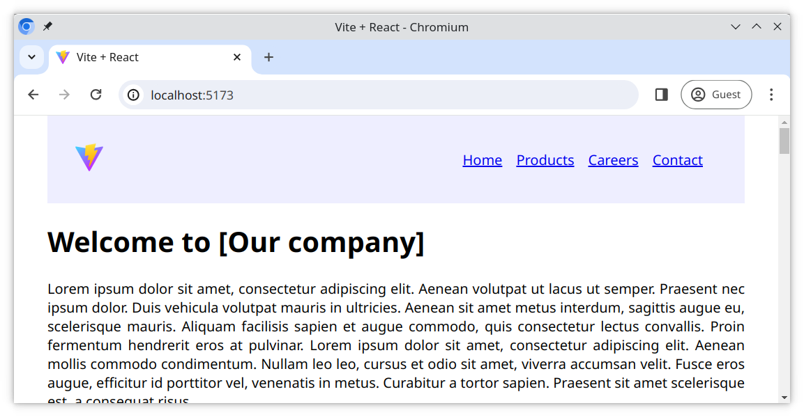

# Übung zum Layouten von Komponenten

Dies ist eine Übung, um das Denken in Komponenten zu üben.

## Was du machen wirst

Folge den Aufgaben, um ein Website-Layout mit Komponenten zu erstellen. Ein Teil des Codes existiert bereits, einen Teil davon musst du selbst codieren.

### Beispiel

## Aufgaben

### Aufgabe 1

- Ändere den Seitentitel in "Welcome to Our Company"
- Füge innerhalb des `<main>` Elements in [src/App.jsx](./src/App.jsx) einen Link hinzu, der den Benutzer zum Anfang der Seite führt

### Aufgabe 2

Wir möchten ein `<footer>` auf unserer Website einfügen;

- Importiere die `Footer` Komponente von [/src/components/Footer.jsx](./src/components/Footer.jsx) in [src/App.jsx](./src/App.jsx)
- Platziere die `Footer` Komponente nach dem schließenden Tag des `<main>` Elements

### Aufgabe 3

Wir werden eine separate Komponente für das `<header>` Element erstellen;

1. Erstelle eine Datei `Header.jsx` im Ordner [src/components](./src/components/)
2. Erstelle in der neuen Datei `Header.jsx` eine leere Komponente namens `Header`
3. Verschiebe das `<header>` Element aus der Datei [src/App.jsx](./src/App.jsx) in diese neue Komponente
4. Verschiebe die Datei [src/Header.css](./src/Header.css) in den Ordner [src/components](./src/components/)
5. Importiere und verwende die neue `Header` Komponente in [src/App.jsx](./src/App.jsx)

> 🐷 Stelle sicher, dass deine Imports und Exports korrekt funktionieren!

> 🐏 Das Verschieben des Headers könnte auch bedeuten, dass die Importe oder Pfade für zugehörige Assets wie Bilder aktualisiert werden müssen!

### Aufgabe 4

Wir werden eine separate Komponente für das `<main>` Element erstellen;

1. Erstelle eine Datei `Main.jsx` im Ordner [src/components](./src/components/)
2. Erstelle in der neuen Datei `Main.jsx` eine leere Komponente namens `Main`
3. Verschiebe das `<main>` Element aus der Datei [src/App.jsx](./src/App.jsx) in diese neue Komponente
4. Importiere und verwende die neue `Main` Komponente in [src/App.jsx](./src/App.jsx)

> 🐥 Stelle sicher, dass deine Imports und Exports korrekt funktionieren!

> 🤖 Verschiebe die Datei [data.js](./src/data.js) nicht

## Hinweise

- Link zur MDN-Dokumentation
- Andere Hinweise
