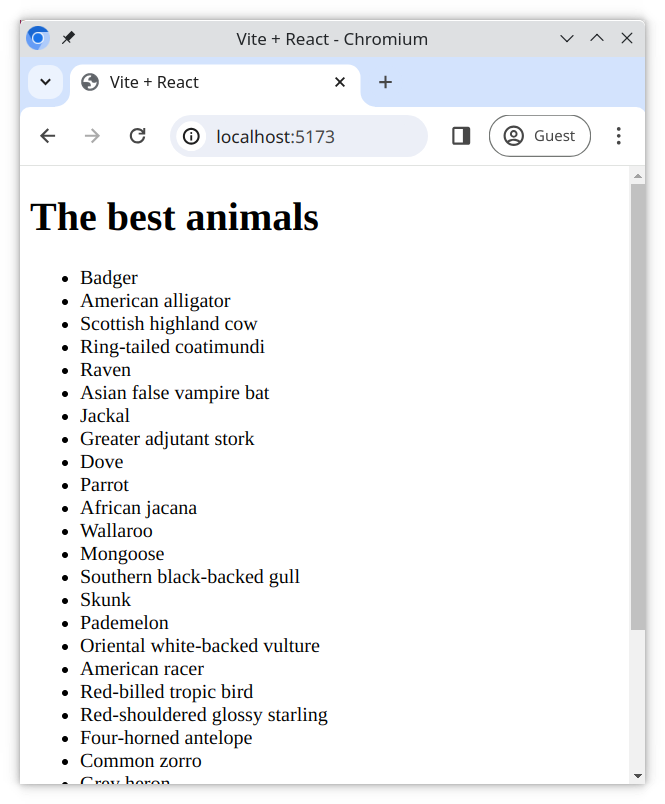

# Components, props and Array.prototype.map()

We've already used the Array `map()` method in Programming Basics. It's especially useful when working with React to create JSX from an array of data. Here you will render a JSX layout from an array of animals and add basic styling.

## Tasks

### Expected Result

### Task 1

1. Create the folder `components` in the [src](./src/) folder
2. Create a file `AnimalList.jsx` in the [src/components](./src/components/) folder
3. In the new `AnimalList.jsx` file, create an empty component called `AnimalList`
4. Export your component and import and use it into the `App` component
5. In the `App` component, pass the `animals` object as a prop into the `AnimalList` component

### Task 2 - props & rendering

The `AnimalList` component will receive a prop called `animals`, which is an array of objects. In the `AnimalList` component;

1. Render a `<ul>` element
2. Use the `map()` method on the `animals` prop to loop through the animals. For each **animal**;

   - Return a `<li>` element with the `name` of each animal as the child text node
   - Use the `id` of each animal as the `key` prop for the `<li>`
   - Each `<li>` element should be a child of the `<ul>` element!

3. Test that your application renders!

> When you run your application in the browser, you should see a list of animals! 😸🐏🐷🐴🐻

### Task 3

We will abstract some of the logic from the previous component into a new component.

1. Create the component `AnimalListItem` in `src/components/AnimalListItem.jsx`
2. `AnimalListItem` will receive a prop called `name`
3. Render a `<li>` containing the `name` prop as the child text node
4. If the `name` prop contains a comma ",", only print the part before the comma

   **Example**: `<li>Badger<li>` instead of `<li>Badger, honey<li>`

5. Export the component

### Task 4

1. Import the component `AnimalListItem` into `AnimalList`
2. Replace the `<li>` in the JSX of your `AnimalList` component with the `AnimalListItem` component, passing in the `animal` `name` and `key` values as props
