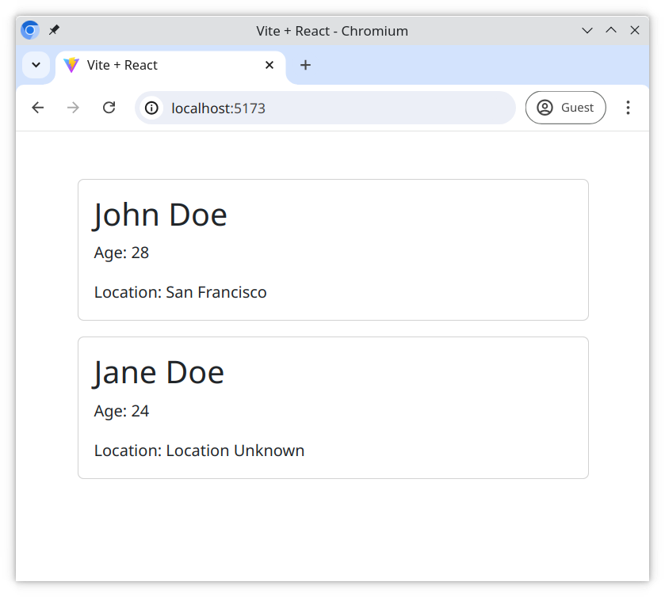

# User Profile with Conditional Rendering

With this exercise you should gain a deeper understanding of the relationship between parent and child components, and how to use conditional rendering to create more dynamic layouts.

## Tasks

### Task 1 - Create the UserProfile Component

Create a `UserProfile` component which will receive `name`, `age`, and `location` as props. It should render the user's `name` and `age`.

> Remember to create your components in the `components` folder!

### Task 2 - Implement Conditional Rendering

Inside the `UserProfile` component, use conditional rendering based on the value of the `location` prop;

- if the `location` prop was passed;
  - Render the `location`
- if the `location` prop was **not** passed (undefined)
  - Render the string "Location Unknown"

### Task 3 - Modify the App Component

Inside the `App` component, render the `UserProfile` component twice, passing in different values each time.

1. For the first `UserProfile` component, pass in the props;

- `age` as `28`
- `location` as `"San Francisco"`

2. For the second `UserProfile` component, pass in the single prop;

- `age` as `24`

## Expected Result



## Bonus Task

Use the `Array.prototype.map()` method to render the following array below. Use the `UserProfile` component for each array item below.

```js
[
  { name: "Nelle Allardyce", age: 40 },
  { name: "Godard Gercken", age: 51 },
  { name: "Afton Nelle", age: 118, location: "Bukui" },
  { name: "Delilah Lumm", age: 70 },
  { name: "Magdaia Tufts", age: 37, location: "Bintawan" },
  { name: "Meghann Bettenson", age: 20, location: "Néma" },
  { name: "Amalia Every", age: 42, location: "Kaberamaido" },
  { name: "Clywd Sarten", age: 85, location: "Fukadale" },
  { name: "Lorilee Junkinson", age: 55, location: "Huangdi" },
  { name: "Lexi Durnell", age: 112, location: "Stobreč" },
];
```

## Happy coding!
