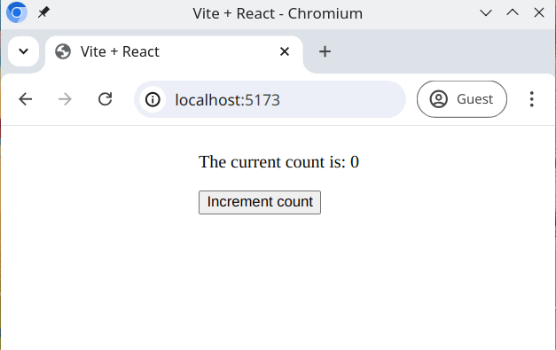

# Olive counter

With this exercise you will get to practice state handling, passing props and conditional rendering.

## Example

## Tasks

This app should render some text based on a state variable and a button.

- When the button is clicked, it should increment a counter
- The count should start from `0` and be handled using the `useState` hook

### Task 1 - Text.jsx

Working in the [src/components/Text.jsx](./src/components/Text.jsx) file, implement the `Text` component;

- This component should render only one `
` element
- This component should receive a `count` prop from its parent
- If `count` is smaller than 10;
  - the `count` value should be rendered in the `
` element
  - **Example**: 'The current count is: 3'
- Additionally, if `count` is greater than 5;
  - the paragraph should have an olive background color
  - Use the `.backgroundOlive` class in [src/index.css](./src/index.css)
- If `count` is greater than 10;
  - the `
` element should keep the olive background color
  - it should render the following sentence instead:
  - **Example**: 'Count is bigger than 10'

### Task 2 - App.jsx

Working in the [src/App.jsx](./src/App.jsx) file, implement the `App` component;

1. Use a `useState` hook to store the `counter` value
2. Import the `Text` component into `App` and render it
3. Pass the `counter` value as a prop into the `Text` component
4. Below the `Text` component, add a `<button>` element
5. When this `<button>` is clicked, increment the `count` state
