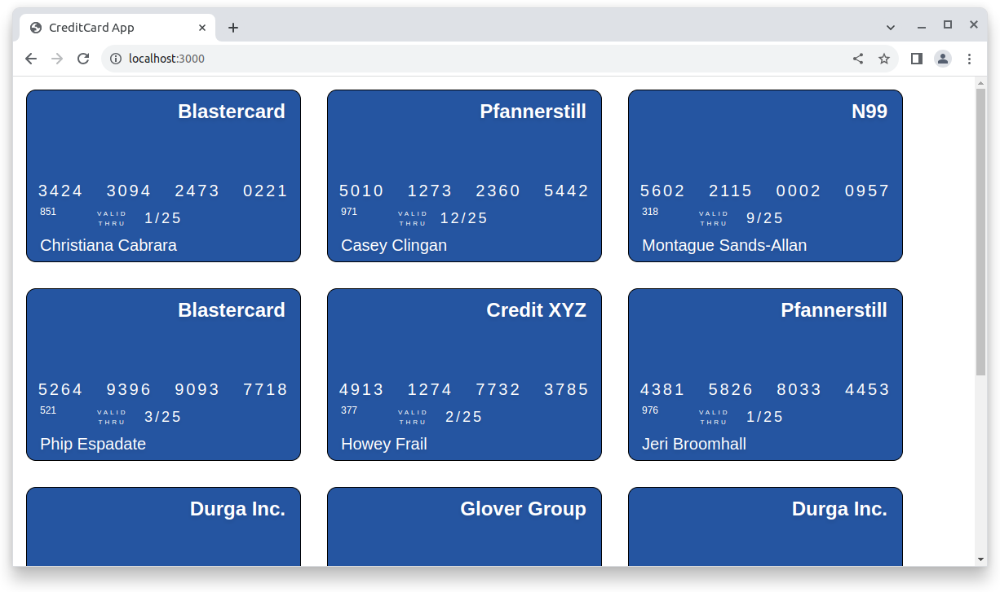

# Credit Card

This exercise challenge is about practicing css with React.

Note: this project was bootstrapped with Create React App. If this is the first one of these that you see, attempt to figure out how to use it based on `package.json`.

## Example

## Requirements

- Examine the example screenshot and build the application as best you can
- Don't edit App.js
