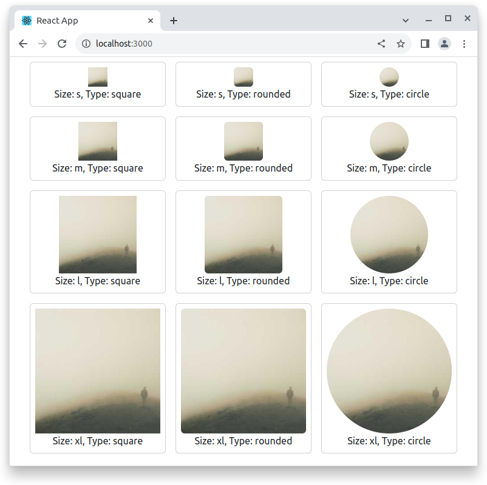

# Avatar component

This exercise is about practicing styling in a React Bootstrap application. In practice this will be reading `react-boostrap` documentation and practicing related props.

You are tasked with completing an `Avatar` component to use in a React application. Work on the existing code to display a website as in the example image below.

## Example

## Requirements

- Don't create any new files
- Only edit `Avatar.js`
- Image sizes
    - s: 32px
    - m: 64px
    - l: 128px
    - xl: 100%
