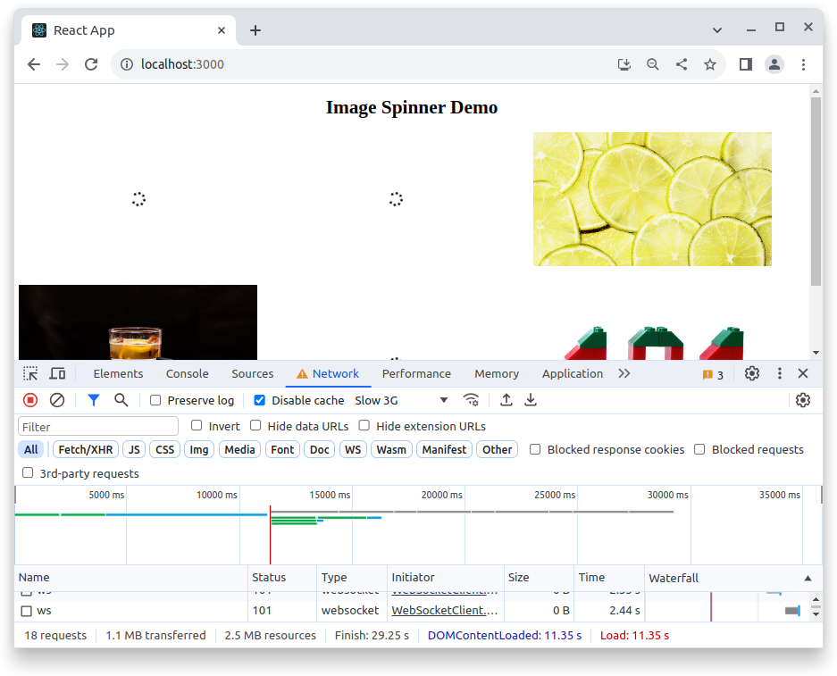

# Image Spinner

This exercise is about practicing styled components and events.

The styles themselves are not that complex, but they might require self-guided research to complete the task. This exercise might require techniques not covered in class, research and problem solving is part of the exercise.

## Example

## Requirements

- Install `https://www.npmjs.com/package/styled-components`
- Don't add any css outside of styled components
- Don't create any elements outside of styled components

- In `App.js`
    - Import the array of image links from `imageLinks.js`
    - Create an `ImgItem.js` component and import it
    - Map through the array, render an `ImgItem` for each image

- In `ImgItem.js`
    - Prepare to render the images/spinners
    - Take in the image `src` from props
    - Import `spinner-solid.svg` from the `images`
    - Render both the spinner and the source image
        - Before the `src` image has loaded, display only the spinner
        - You can use `display:none`
        - After the image has loaded, display only the image

    - To keep track of when the image will be loaded, use `onLoad`
        - For reference,search `onLoad` in the docs https://react.dev

    - Use CSS animation with `@keyframes` to rotate the spinner

- Testing method
    - Open the browser devtool, go to the "Network" tab
    - Select a slow connection under "throttling", e.g. "Slow 3G"
    - Check the "Disable cache" box
    - Refresh the page
