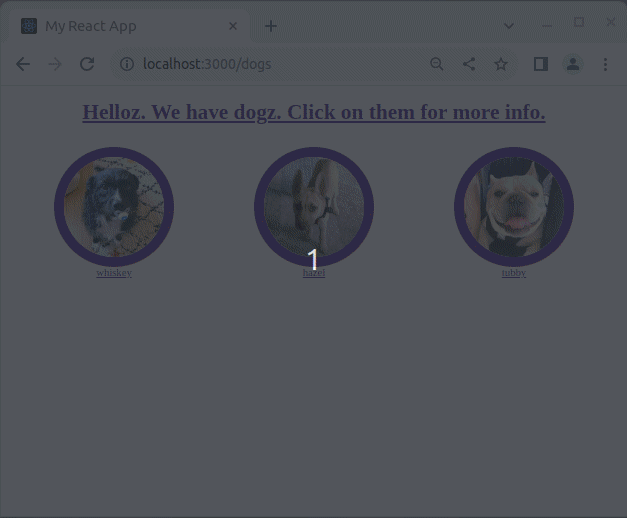

# Dog Finder

Build an app that routes to different dogs and displays information on the dog whose route you are on.

## Requirements

- Don't create any new files :)

- The homepage is `/dogs`, which shows all dogs as links
    - Use NavLink to contain the dog image and name
    - NavLink will help you know which link is active

- Import the dog data to use into `App` from `data.json`
- All paths that are not `/dogs` should navigate to `/dogs`
- Clicking on the `h1` should take you to `/dogs`

- Clicking on a dog you to that dogs route
    - clicking on Whiskey will take you to `/dogs/whiskey`
    - clicking on Tubby will take you to `/dogs/tubby`
    - clicking on Hazel will take you to `/dogs/hazel`
    - You have to use route parameters for this

- The route of a dog should
    - display the image of the dog
    - display the facts of the dog

## Example

