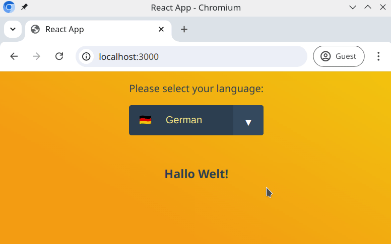

# Using the useContext hook for setting application language

This exercise is about practicing the `useContext` React hook. Using this hook, we will store the state for the language selection in the application.

## Example

## Task

Display a dropdown selection, where the user can choose between different languages.

Create the following components and structure your app as follows;

`App`

- `Header`
  - `LanguageChooser`
- `Content`
  - `WelcomeMessage`

For example, in the above diagram `App` has `Header` and `Content` as child components, and `Header` has `LanguageChooser` as a child component.

## Requirements

- `LanguageChooser` should display a dropdown-list of available languages
- `WelcomeMessage` should show a message in the chosen language, for example;

  - GER: "Hallo Welt!"
  - ENG: "Hello World!"
  - Feel free to add other languages 🐻

- Changing the language selection in `LanguageChooser` should update the language used across the app
- Style to your liking

## Expected Result

