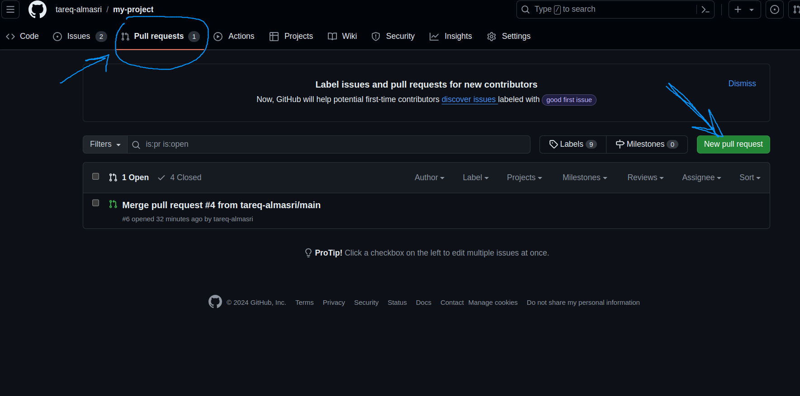
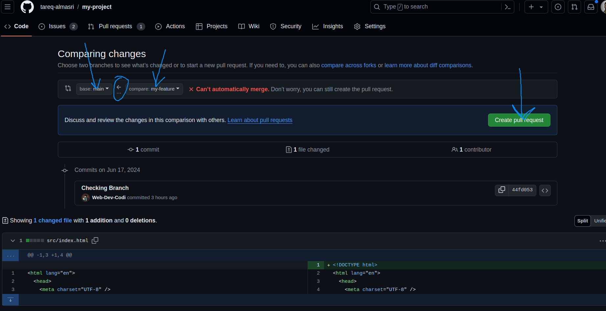
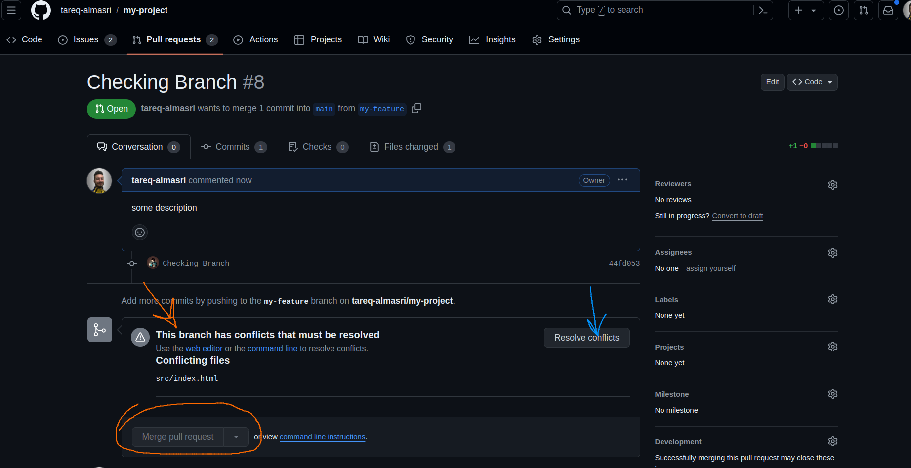
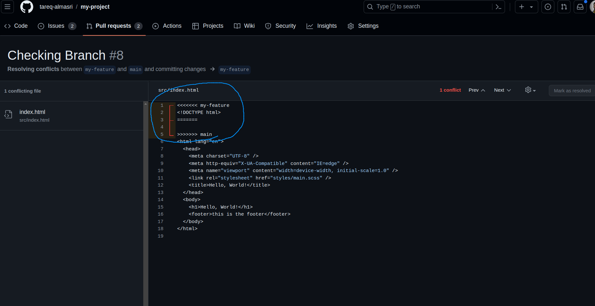
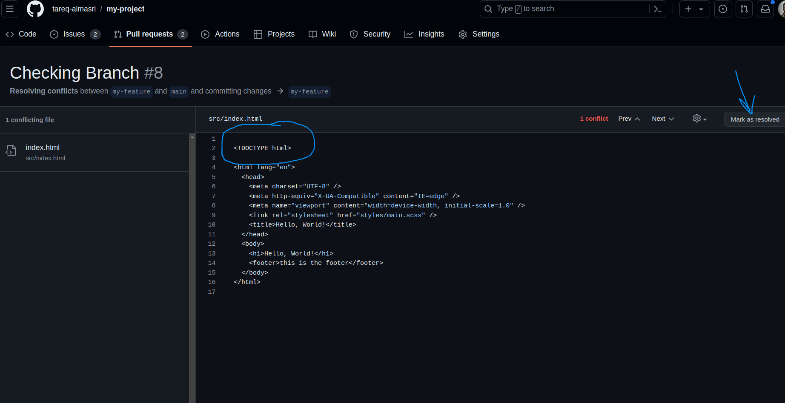
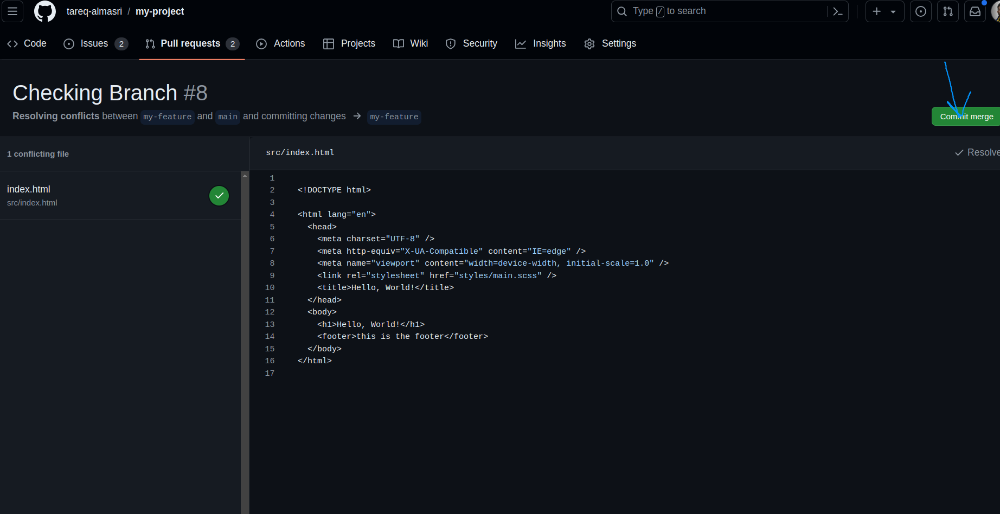
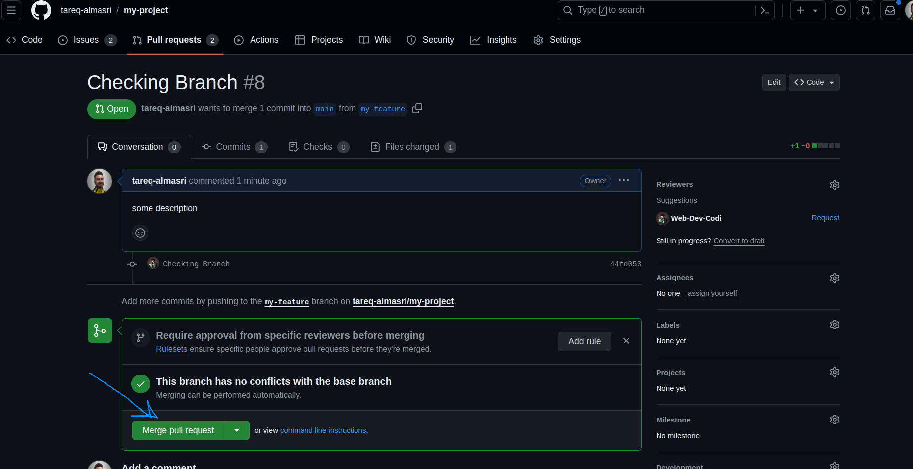
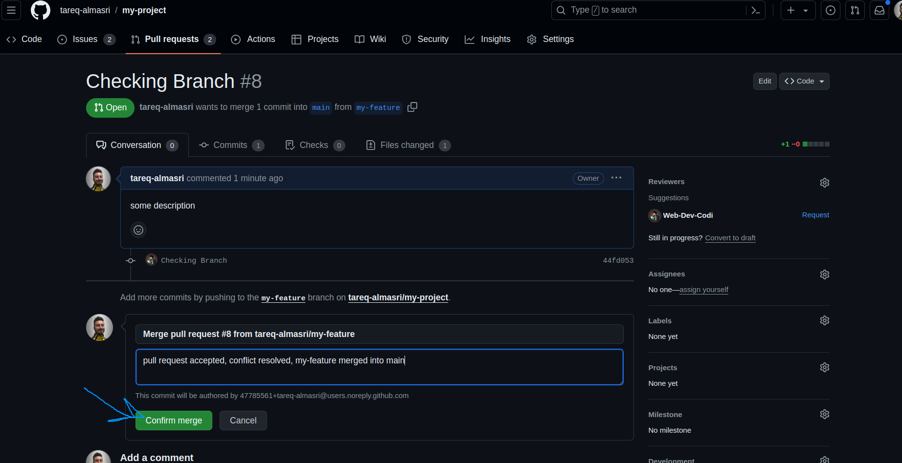
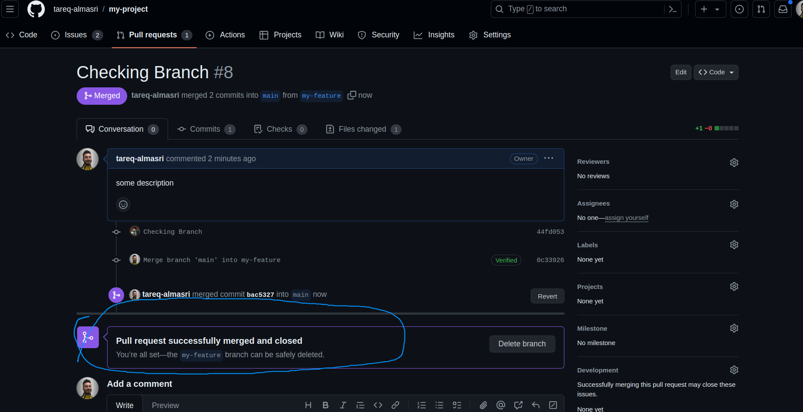

# github workshop:

## pull requests:
- making a pull request from the browser with a conflict:
 
 
 

 - resolving that conflict and accepting the pull request and merging it into main by the project owner:

- doing the same thing but from the terminal using gh cli:
  - team member: creating the pull request:

`gh pr create -t "new feature" -b "please review and merge"`

  - project owner: checking all pr list:

`gh pr list`

  - project owner: checking one pr from branch "my-feature":

`gh pr checkout "my-feature"`

  - project owner: merging branch "my-feature" into main:

`gh pr merge "my-feature`

for more options check the gh-cli [manual](https://cli.github.com/manual/)

## useful git commands:

- checking old commit: `git checkout <commit ID>`
- checking old commit and making a new branch for it (good when you want to edit that old code): `git checkout -b <new-branch-name> <commit ID>`
- reverting back to an old commit (keeps the history log): `git revert <commit ID>`
- resetting back to an old commit (doesnt keep the history log): `git reset --hard <commit ID>`
- list of all commits: `git log`

