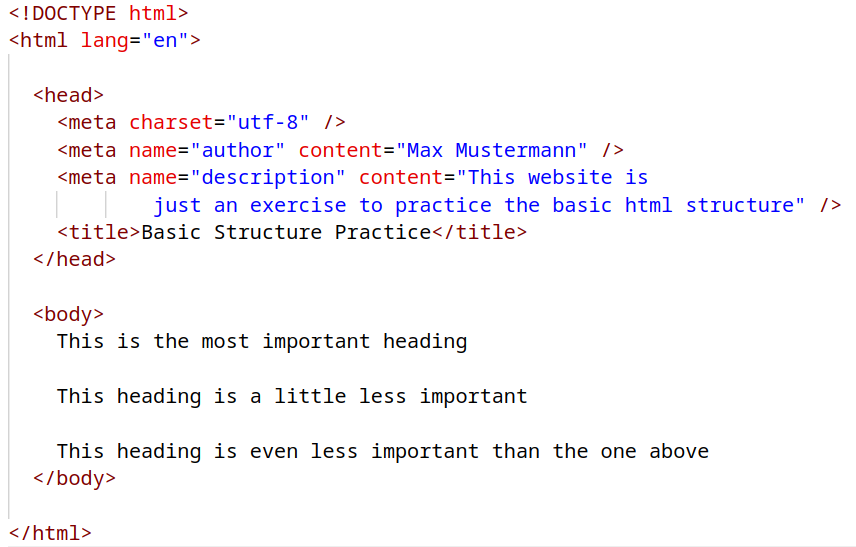

# Basic Structure

Practice basic HTML editing, by creating an HTML file based on a sample image

## Tasks

Use the following image as a reference to complete the tasks below.

### Task 1

- Create a file named `index.html`
- Create an HTML structure as shown in the example image
- Replace the name in the author `<meta>` with yours

### Task 2

- Wrap the three lines in the `<body>` element with correct appropriate heading element
- Add a `title` attribute for each heading element with the name of the element as the value. A **hover tooltip** should display when the cursor hovers over the element.
- Add a paragraph below each heading, with any text you like

### Task 3

- Use the `<pre>` element to add the text from the following [file](/assets/logo.txt) into your HTML page. This tag should keep the formatting of the text intact.

### Task 4

- Add an HTML comment to each element in the document, explaining what the element does
