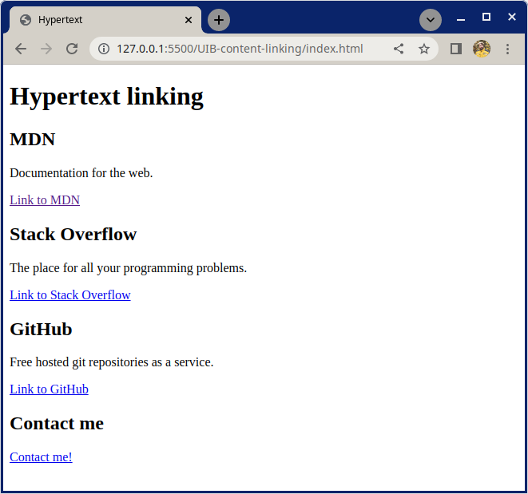

# Hypertext Linking

Practise building hyperlinks with the anchor `<a>` element, so that users can navigate to other content.

## What you will be doing

Work in the included `index.html`. HTML5 Boilerplate code has already been provided.

### Example

## Tasks

### Task 1

Add an `<h1>` to give the page a main heading. Use the text "Hypertext linking".

### Task 2

For each of the sections MDN, Stack Overflow and GitHub;

- Create a `<section>` element which contains;
  - An `<h2>` element with the name of the website you're linking to
  - A `
` with a description of the website you're linking to
  - An `<a>` element linking to the website

### Task 2

- Create a `<section>` which contains;
  - An `<h2>` element with the text "Contact me"
  - An `<a>` element that is a "mailto" email link

> Not sure what a **mailto** link is? [See here](https://developer.mozilla.org/en-US/docs/Learn/HTML/Introduction_to_HTML/Creating_hyperlinks#email_links)

[//]: # (autograding info start)
#  Results
> ⌛ Give it a minute. As long as you see the orange dot  on top, CodeBuddy is still processing. Refresh this page to see it's current status.
>
> This is what CodeBuddy found when running your code. It is to show you what you have achieved and to give you hints on how to complete the exercise.

### Links

|                 Status                  | Check                                                                                    |
| :-------------------------------------: | :--------------------------------------------------------------------------------------- |
|  | Page should contain 4 section elements |
|  | Page should contain 4 links |
|  | Page should contain a link to MDN |
|  | Page should contain a link to Stack Overflow |
|  | Page should contain a link to GitHub |
|  | Page should contain a `mailto:` link |

[🔬 Results Details](../../actions)
[🐞 Tips on Debugging](https://github.com/DCI-EdTech/autograding-setup/wiki/How-to-work-with-CodeBuddy)
[📢 Report Problem](https://docs.google.com/forms/d/e/1FAIpQLSfS8wPh6bCMTLF2wmjiE5_UhPiOEnubEwwPLN_M8zTCjx5qbg/viewform?usp=pp_url&entry.652569746=UIB-content-linking)

[//]: # (autograding info end)