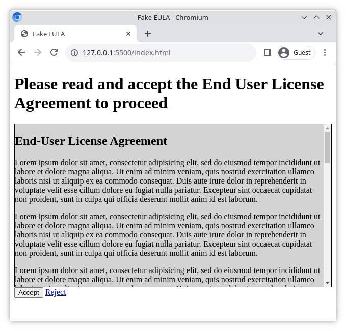

# Fake EULA (End User License Agreement)

With this exercise you can practise using the `overflow` CSS property.

## What you will be doing

You will be creating a page that will be to shown to a user during the account registration process. The page contains an EULA (End User License Agreement) that the user must approve to proceed with the registration. You will be provided with the files you need, and a basic structure to start from.

### Example

## Tasks

### Task 1

- Open `index.html` with the VS Code Live Server extension
- Add a top-level heading with the text **Please read and accept the End User License Agreement to proceed**

### Task 2

- Add an **Accept** button at the bottom of the page
- Add a **Reject** link which redirects the user to [https://example.org](https://example.org)

### Task 3

- Add styling to `style.css` to make the page match the example screenshot as close as you can
- In the example, the height of the gray EULA box is `20em`

### Task 4

In the example image, the gray EULA box contains a vertical scrollbar.

- Use the CSS `overflow` property to make the vertical scrollbar visible.

#### Hints

- [MDN: CSS overflow](https://developer.mozilla.org/en-US/docs/Web/CSS/overflow)
