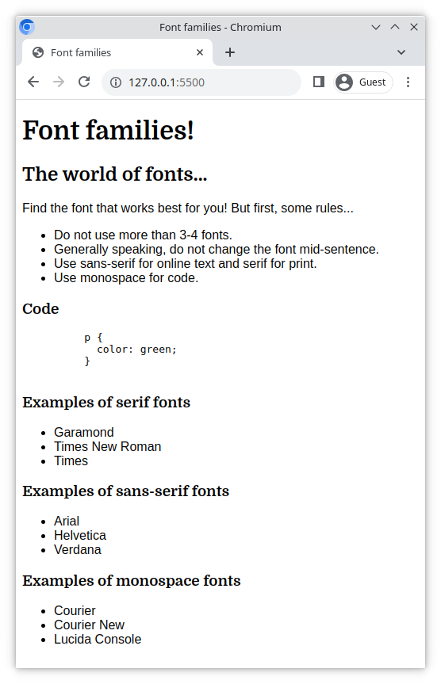

# Font families

Did you know that you can specify multiple fonts for the same element in your CSS? Here you will use the CSS `font-family` tag in combination with fonts supplied from Google Fonts.

## Task

For this exercise, choose your fonts from [Google Fonts](https://fonts.google.com/).

Using the `font-family` CSS property;

- Choose and specify a `serif` font for all the headings on the page
- Choose and specify a list of `sans-serif` fonts for all the elements nested in the `main` element
- Choose and specify a `monospace` font for the `
` element with the class `code`
- All `font-family` properties should also include a generic font family name at the end of the stack

> Don't forget to import the Google Fonts you chose into your HTML!

### Example

Your end result might look something like this (your fonts may be different);

