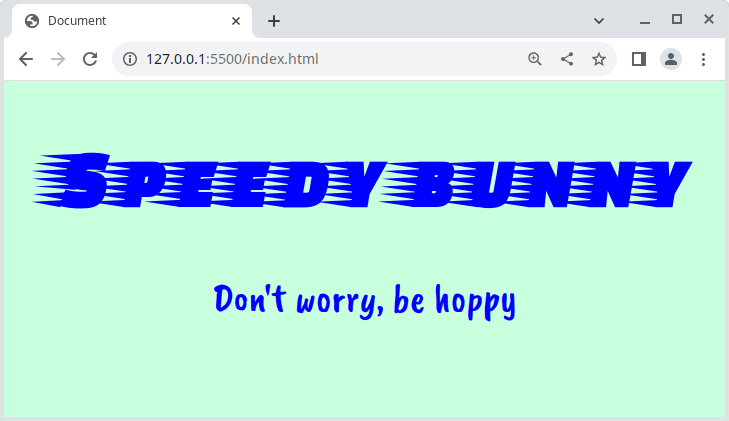

# Bunny fonts 🐇

Bunny fonts are a good alternative to Google Fonts, especially when privacy and GDPR compliance is an issue. Perform your own research and work independently to solve this task.

## Task

Recreate as closely as possible, the website in the reference image below using fonts from [Bunny Fonts](https://bunny.net/fonts).

### Example

