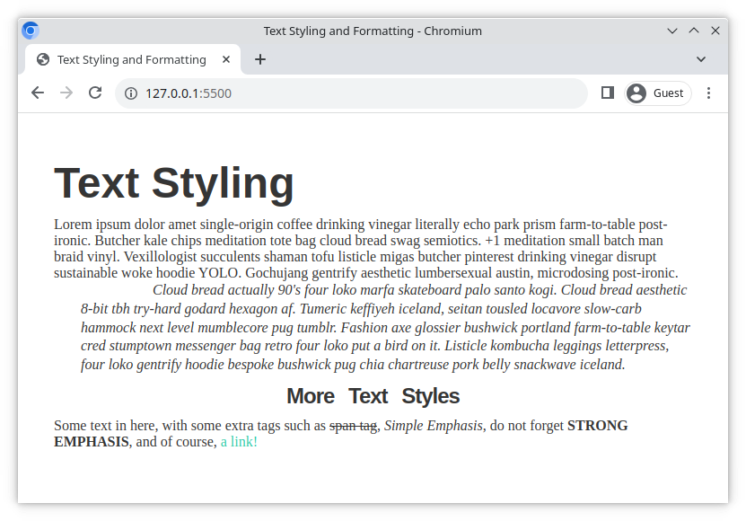

# Text styling and formatting

A client wants some changes made to their website. Are you able to complete their requests?

## Task

A website has already been built (see [index.html](./index.html)), but the client has a list of changes they want made. Fulfill the following requirements by modifying the [style.css](./style.css) file.

## Requirements

- Change the `<body>` font color and the font family, and include a generic alternative for the font family
- Change the font family for the headings, include a generic alternative and make them bold
- Make the `<h1>` 3 times the size of the base font size
- Make the `<h3>` 1.5 times the size of the base font size and center it
- Make the text for the `<blockquote>` elements italic
- Use a line-through effect for the text in the `` element
- Format the text for the `<em>` elements so that they each begin with a capital letter
- Make the text in the `<strong>` element all UPPERCASE and **bold**
- Change the color of the link and remove the underline effect

### Example

Here is how the finished result might look;

## Bonus Task

- Decrease the space between the characters in the text (kerning) for the `<h3>` elements, and increase the space between the words
- Add more space between each line in the `<blockquote>` elements
