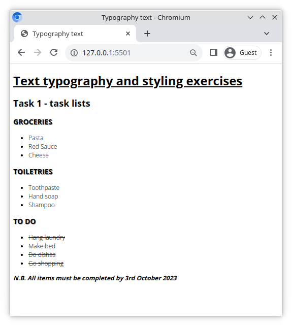
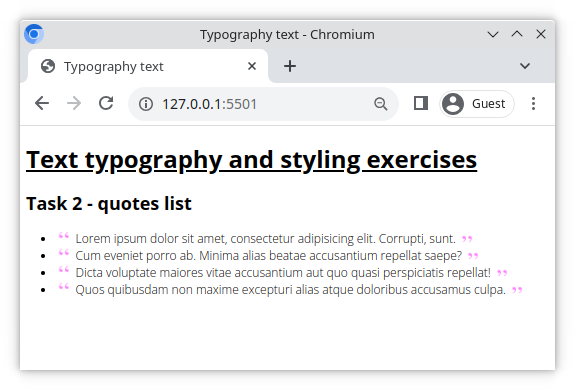
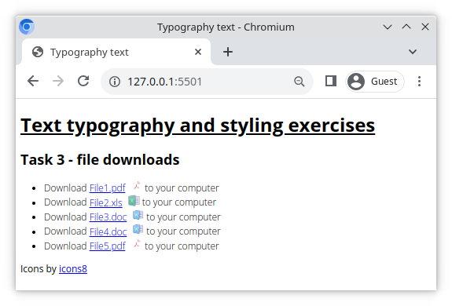
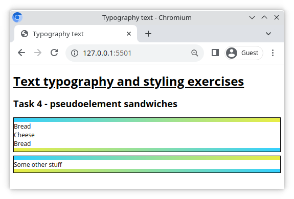

# Einkaufsliste

Dieses Übungsbeispiel besteht aus einer Reihe von Typografie-Aufgaben.

## Was du tun wirst

Arbeite in der beiliegenden HTML-Datei und erstelle eine CSS-Datei namens `style.css`. Danach führe die unten aufgeführten Aufgaben aus. Viel Erfolg!

## Aufgaben

### Aufgabe 1

- Wähle eine Schriftart bei Google Fonts aus und importiere sie mit dem HTML-Link-Tag.
- Wähle verschiedene Schriftstärken aus, z.B. light(300), regular(400), bold(700).
- Wende die Schriftart auf alle Elemente auf der Seite an.
- Unterstreiche die Überschrift h1.
- Gib allen Listenelementen einen hellen *300* Schriftschnitt (font weight).
- Gib allen Überschriften mit der Klasse `heading` einen Schatten und sorge in CSS dafür, dass alle diese Elemente in Großbuchstaben erscheinen.
- Gib dem Element mit der Klasse `note` eine fette Schriftstärke (font weight). Lass den Text kursiv erscheinen.
- Streiche alle Elemente mit der Klasse `todo-item` durch.

### Aufgabe 2

- Erstelle eine ungeordnete Liste von Lorem-ipsum-Zitaten mit emmet.
- Pseudo-Elemente anwenden, um ein Zitat-Symbol vor und nach jedem Zitat zu platzieren.
- Verwende das beiliegende `quote.png` für das Quellbild.
- Tipp: Du kannst ein Element mit `rotate:180deg;` drehen.

### Aufgabe 3

- Verwende Pseudo-Elemente, um die unten gezeigte Dateilinkliste nachzubauen.
- Nach jedem Dateinamen in der Linkliste wollen wir den entsprechenden Dateityp als Symbol anzeigen.
  - Füge die folgenden Dateitypen in die Linkliste ein: `.pdf`,`.xls`, `.doc`
  - Symbole
    - PDF: https://img.icons8.com/officel/64/000000/pdf.png
    - XLS: https://img.icons8.com/dusk/64/000000/ms-excel.png
    - DOC: https://img.icons8.com/dusk/64/000000/ms-word.png
- Verwende Attributselektoren, um Dateien nach Typ auszuwählen, und verwende dann ein Pseudo-Element, um das passende Dateisymbol hinter jedem Listeneintrag zu platzieren.

### Aufgabe 4

- Erstelle mit den Pseudo-Elementen `::before` und `::after` das unten gezeigte 'sandwich div'.
- Tipp: Verwende nicht die `border` für die Farbverläufe.
    - Mach die Pseudoelemente zu Blockebenen mit Breite und Höhe und gib ihnen einen linearen Farbverlauf als Hintergrund.

