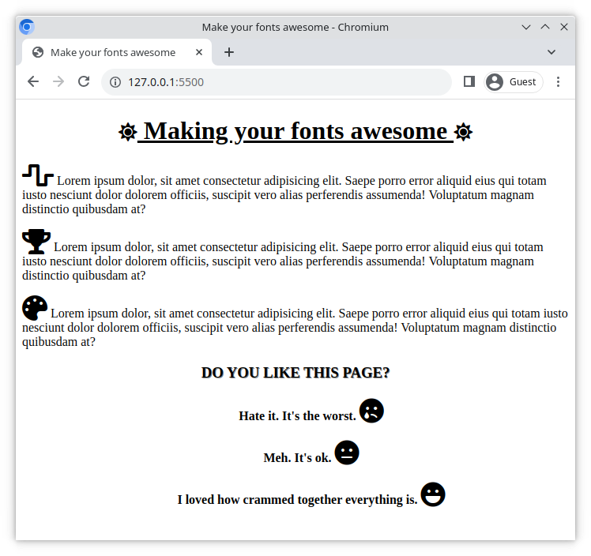

# Make your fonts awesome!

Font Awesome is a popular toolkit, which makes it easy to implement icons onto your website. Here you will get a chance to use it to enhance an existing page!

## Task

A website has already been built for you (see [index.html](./index.html), and [style.css](./style.css)). Complete this exercise by fulfilling the requirements below.

## Requirements

> Before starting, setup **Font Awesome** to work on your website! If you're not sure, ask your teacher or follow the [online guide](https://fontawesome.com/start)

- Add a Font Awesome icon to the start and end of the `<h1>` heading
- Center and underline the `<h1>` heading
- Center the element with the class `.review`. Give this element a text shadow and use CSS to format the text as UPPERCASE.
- Add icons to the beginning of each `
` element nested in the sections with class `.info`
- Add an appropriate icon after each review option
- Set a size for the icons on the page

### Example

Here is an example of how your website might look (your icons might be different);

