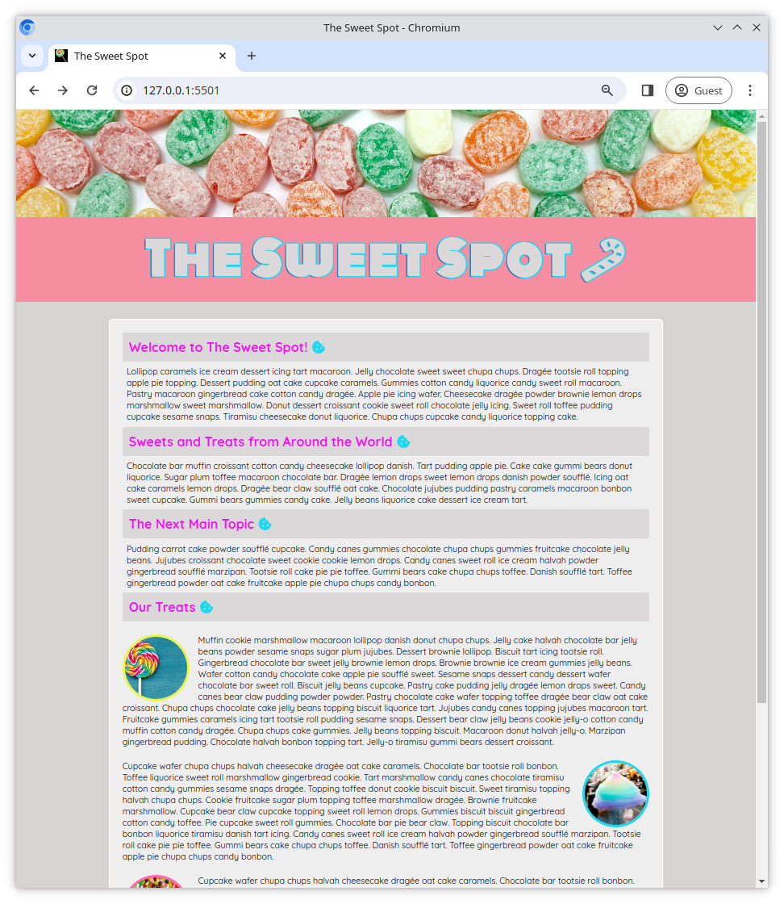
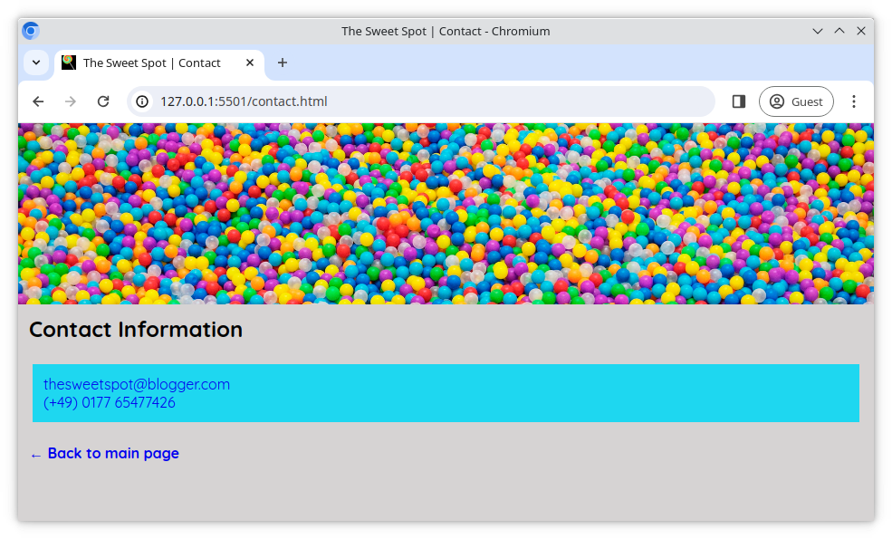

# The Sweet Spot v4

Let's improve the website _The Sweet Spot_ by adding some new additions to our user interface to make it a bit more modern and professional.

## Task

Some HTML ([index.html](/index.html), [contact.html](/contact.html)) and CSS ([style.css](/style.css)) have already been prepared for you. Working in these files, complete the requirements outlined below. You can use the reference images as a guide.

## Requirements

- Use `lollipop.ico` from the `images` directory as the icon for your page. It should display in the browser tab.
- Import the **Quicksand** and **Monoton** fonts from **Google Fonts** and use as shown in the reference images
- Add a `text-shadow` to the `h1` element in the `header` to achieve the outline effect in the reference images
- From [Fontawesome](https://fontawesome.com/), add the **candy cane** and **cookie** icons to the page
- Add the **back arrow** to the "**Back to main page**" text on the contact page
- Take a few moments to look at the [live version](https://digitalcareerinstitute.github.io/UIB-UI-UX-the-sweet-spot-v4/) and implement any other small changes that are present
- As always, aim to be **pixel perfect**, matching the design screenshot as closely as possible 😀

### Reference images

#### Main Page

#### Contact Page

