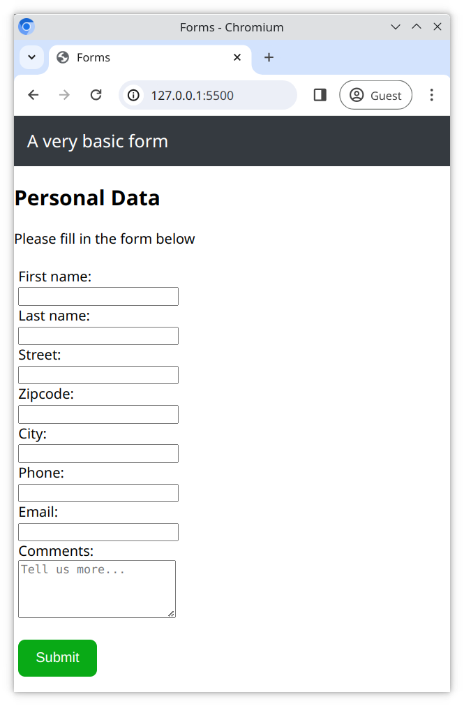

# Ein einfaches Formular

Wir können Daten von einem Benutzer mit einem Formular sammeln. Hier erstellst du ein einfaches Bestellformular, um einige grundlegende persönliche Daten (Name, Adresse usw.) zu sammeln.

## Aufgabe

Arbeite in den Dateien [index.html](./index.html) und [style.css](./style.css) und erstelle ein Formular, das die folgenden Anforderungen erfüllt.

## Anforderungen

- Verwende `<input>` oder `<textarea>` Felder, um die folgenden Informationen zu sammeln;
  - Vorname
  - Nachname
  - Straße
  - Postleitzahl
  - Stadt
  - Telefonnummer
  - E-Mail
  - Kommentare
- Verwende für jedes `<input>` oder `<textarea>` Feld ein `<label>` Tag
- Verwende den passenden **Input-Typ** für jedes `<input>` Feld. Zum Beispiel `email` für die **E-Mail** Adresse
- Füge einen **Absenden** `<button>` hinzu
- Stelle sicher, dass die `<input>` Felder in einer einzigen Spalte erscheinen und nicht nebeneinander
- Gestalte deine Formularelemente mit CSS
- Füge deiner Seite eine `<header>` hinzu
- Verwende das untenstehende Referenzbild als deinen Stil-Leitfaden

> Vergiss nicht, deine Webseite mit dem Boilerplate HTML5 Code zu beginnen!

## Referenzbild

