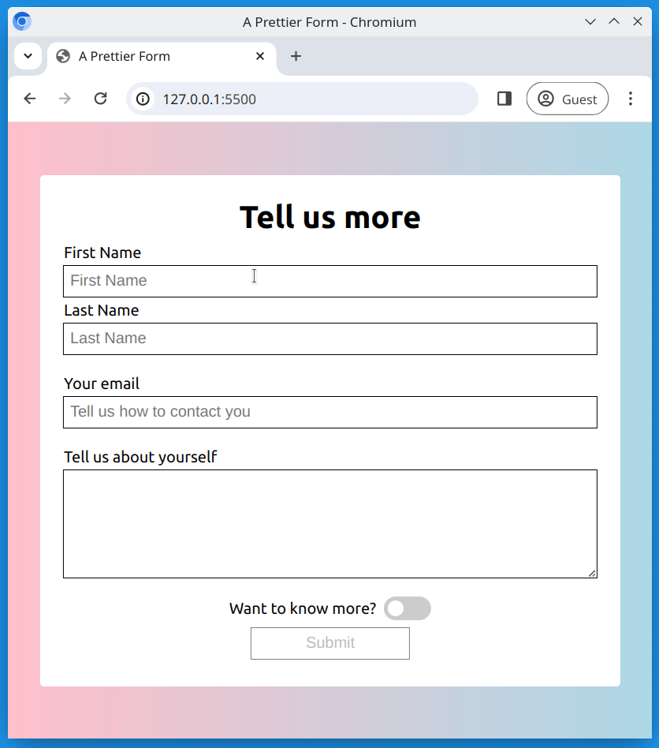

# Outlining form fields

Let's extend our knowledge with forms, by using some more advanced techniques!

## Task

Working in the files [index.html](./index.html) and [style.css](./style.css), create a form which meets the following requirements. Your finished result should look like the reference image below.

## Requirements

- Use `<input>` or `<textarea>` fields to collect the following information;
  - First name
  - Last name
  - Email
  - Tell us about yourself
- Use a `<label>` tags for each form element
- The form should also have a checkbox which is styled as a toggle switch
- Use CSS attribute selectors to target and style;
  - `text` type input fields should have a `hotpink` outline on focus
  - The input field with the type `email` and the `<textarea>` should have a `blue` outline on focus
- At the end of the form, there should be an input for submit. This input field should be `disabled`.

## Reference Image

## Bonus Task

- Remove the `disabled` attribute from the submit button
- Add form validation
- Connect the form to [formspree.io](https://formspree.io/) so you can collect user input
