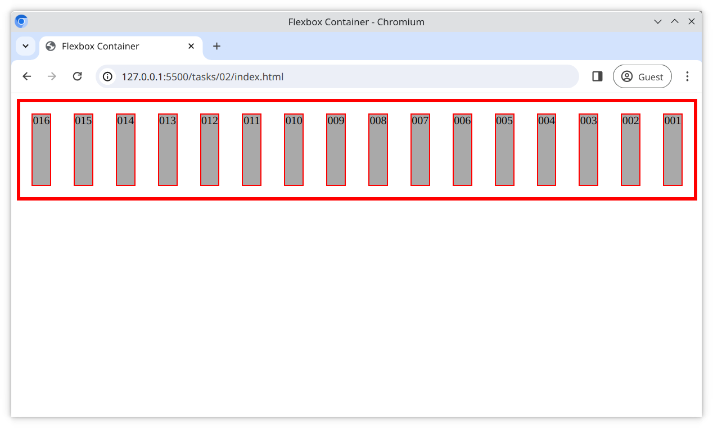

# Task 2

Modify the [main.css](./main.css) file and;

- Use flexbox to layout all `
` elements in a row, but in **reverse order**
- Center the rows horizontally within the container

## Reference Image

