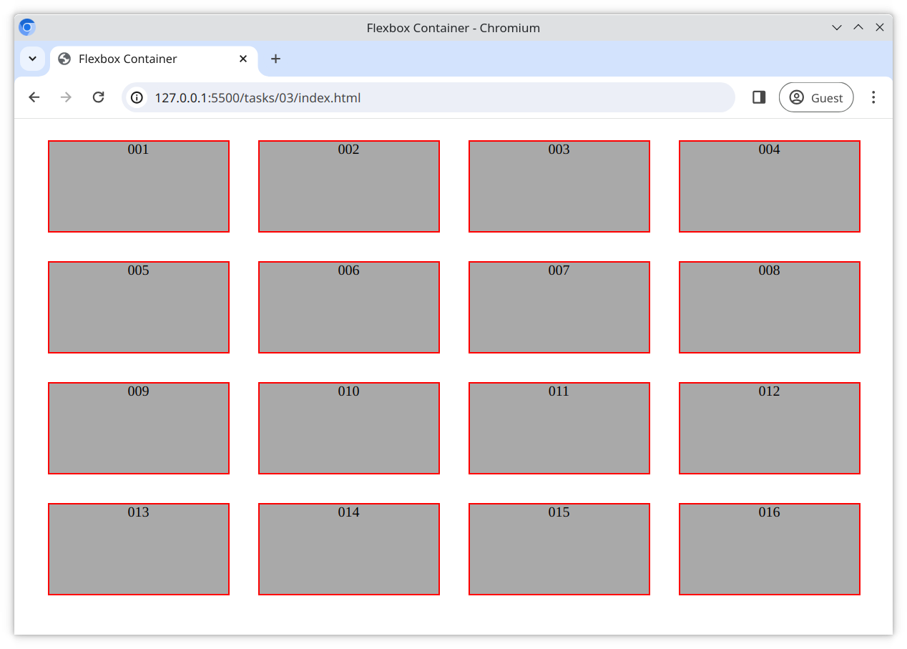

# Task 3

Modify the [main.css](./main.css) file and;

- Use flexbox to layout all `
` elements in a row
- Use `flex-wrap` so that the `
` elements are wrapped onto multiple rows
- Center the rows horizontally within the container

## Reference Image

