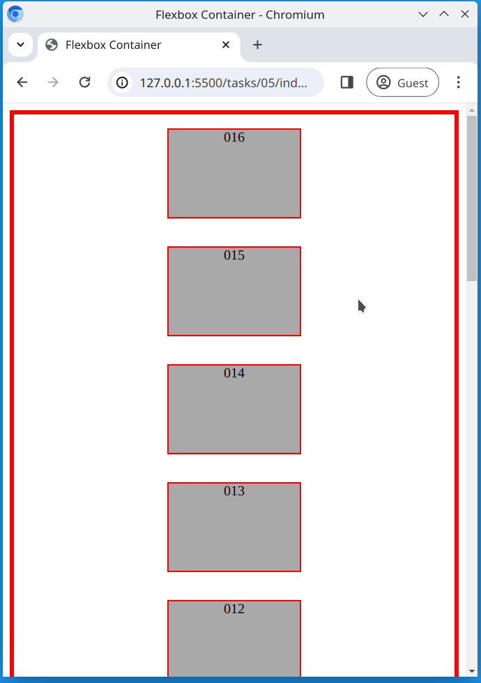

# Task 5

Modify the [main.css](./main.css) file and;

- Use flexbox to display all `
` elements in one column, but in **reverse order**
- Center the rows horizontally within the container

## Reference Image

