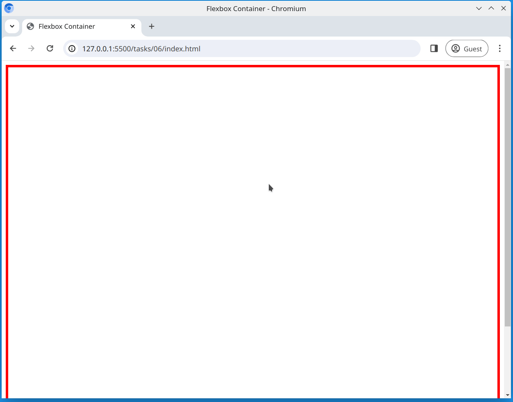

# Task 6

Modify the [main.css](./main.css) file and;

- Use flexbox to layout all `
` elements in a row
- Make all `
` elements appear at the bottom of the container
- Center the rows horizontally within the container
- The `
` elements should all appear on one line

## Reference Image

