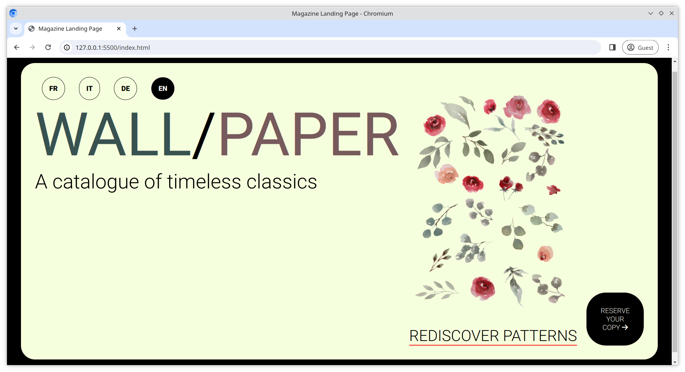

# Magazine Landing Page

A standalone page which is used for marketing or advertising, is called a landing page. For this exercise we'll create the landing page for a fictional magazine called "Wall/paper".

## Task

For this task you will have to update both the [index.html](/index.html) and [style.css](/style.css) files.

## Requirements

- Use **flexbox** to recreate the design in the reference image below
- Use semantic html tags i.e. `<section>`
- Use `:hover` effects where you feel necessary
- Use the arrow right icon from **FontAwesome**
- Use the font _Roboto_ from **Google Fonts**
- The page should cover the entire width of the browser window
- Don't worry about responsiveness, implement your design for a full width desktop
- Here is the main graphic used on the page [/assets/design.png](/assets/design.png).

## Reference Image

