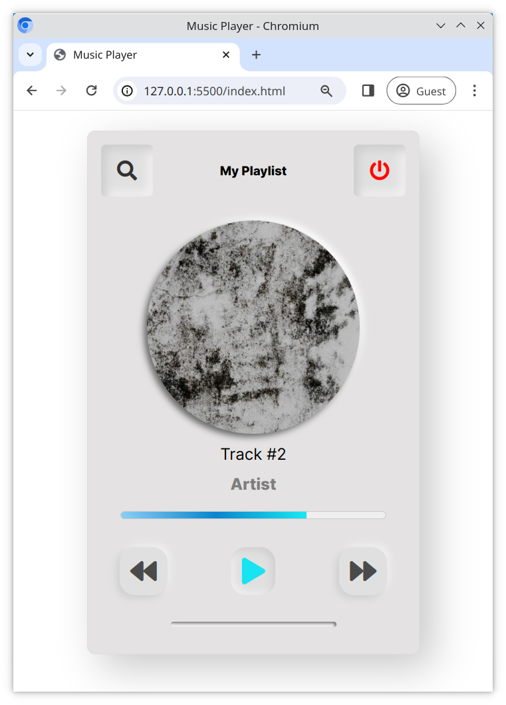

# Neumorphic Music Player

Neumorphism is another UI trend which has become popular. Here you will get a chance to build a music player with this design style.

## Task

For this task you will have to update both the [index.html](/index.html) and [style.css](/style.css) files.

- Spend some time researching the UI trend "Neumorphism" and what makes it unique before beginning

## Requirements

- Use **flexbox** to recreate the design in the reference image below
- Use icons from [fontawesome](https://fontawesome.com/) for the UI
- Use the font _Inter_ from **Google Fonts** for the text
- Feel free to add a photo of an artist you like and include the artist and track name in the player
- Create a `linear-gradient` for the song progress bar

## Hints

- When creating the buttons for the UI of the music player, you can use the `box-shadow` CSS property to recreate the Neumorphism design characteristics
- For the song progress bar, consider using the [<meter>](https://developer.mozilla.org/en-US/docs/Web/HTML/Element/meter) element

## Reference Image

