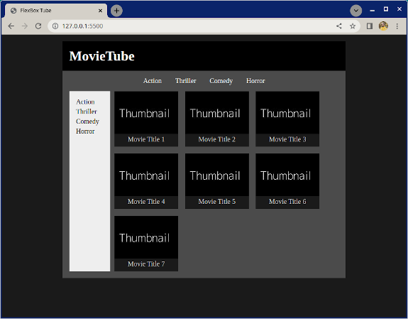
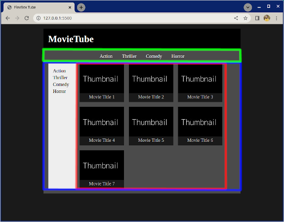
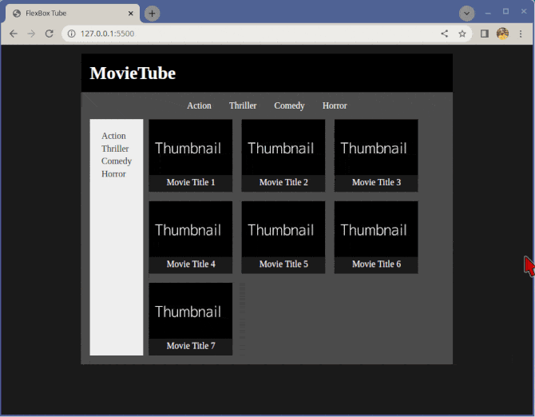

# Flexbox Tube

This exercise is about practicing `flex-wrap` and general layouting with nested flexboxes.

## What you will be doing

Create the layout of the page as seen in the reference image below. Use images from the `images` folder.

## Tasks

### Task 1

- Examine the reference image
- Think about what elements and containers you might have
- Add the the basic HTML structure you think you might need for page
- For reference:
    - Use the included the included [Thumbnail image](./images/thumbnail.jpg)
    - All text is black or white
    - The background shades of gray are
        - Main background: #1a1a1a
        - MovieTube heading background: #000000
        - Content area background: #4b4b4b
        - Sidebar background: #eeeeee
        - Movie card/title background: #1a1a1a

### Task 2

- Make the highlighted elements in the image below flex containers
    - Green flex container for the genre selection on the top
    - Blue flex container for the sidebar and movie list
    - Red flex container for the movie list
        - Note that the red flex container is inside the blue

            

Each individual movie card inside the movie list container is also a flex container to get the thumbnail and movie aligned.

### Task 3

- Implement the page to look and work as close as you can to the reference animation

    

### Optional bonus task

- For fun you can also add actual movie names and posters!