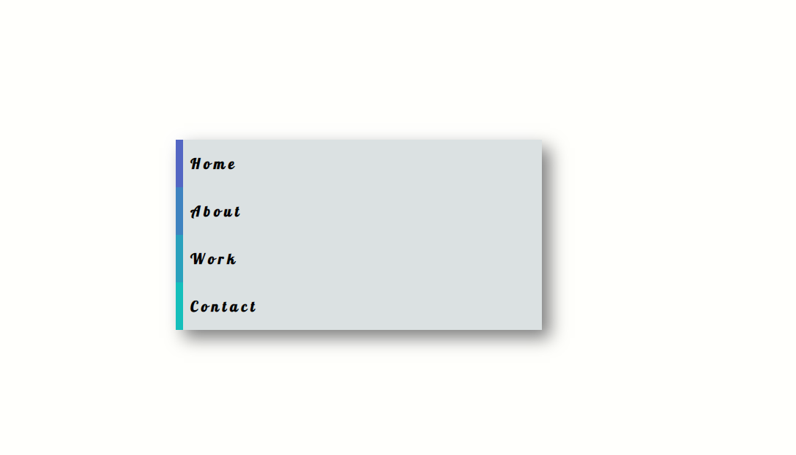

# Site menu

Take a look at the example and try to recreate the effect.
1. Use anchor tags to create 4 or more menu items.
3. Give each link a unique `background-color`.
4. Utilize the `transition` and `transform` css properties to create a smooth transition on hover.

