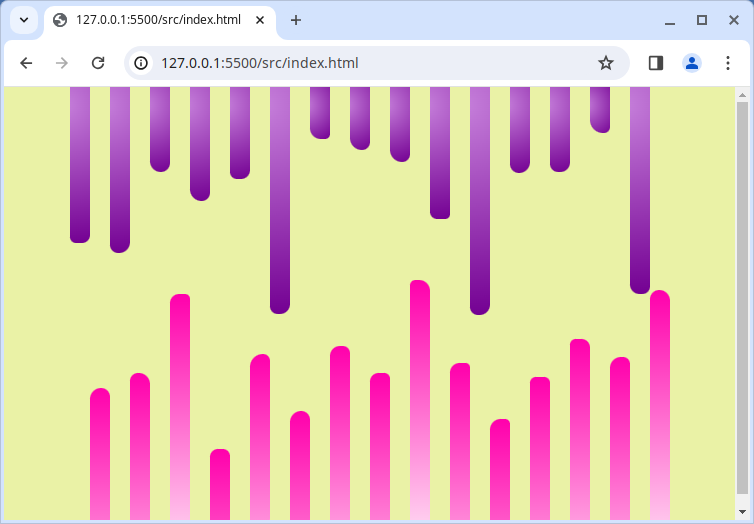

# Random Bars

Let's create some random bars with SASS. A big part of this challenging exercise is research and experimentation. Try to match the style of the example image with randomized border radiuses and bar heights.



To run, run the following in your terminal:

```bash
$ npm install && npm start
```

Make use of [SASS loops](https://sass-lang.com/documentation/at-rules/control/for) and the `random()` function that is built-in SASS.

## Bonus

The bonus challenge this time is to animate the bars to change their height, at a random speed.
